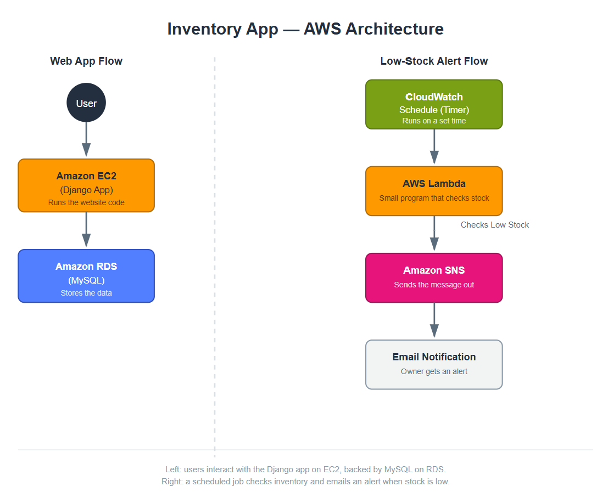

# AWS Inventory Monitoring System


A cloud-based inventory management system built with **Django** and **Amazon Web Services (AWS)**.

The application enables administrators and warehouse managers to securely manage inventory through a web interface while automating low-stock monitoring using serverless AWS services. A scheduled AWS Lambda function periodically checks inventory levels and sends email notifications through Amazon SNS whenever stock falls below configured thresholds.

---

# Table of Contents

- Project Overview
- AWS Architecture
- AWS Architecture Overview
- Key Features
- Technology Stack
- Project Workflow
- Application Screenshots
- Repository Structure
- Installation
- Future Enhancements
- Cloud & Development Skills
- Author

---

# Project Overview

This project demonstrates how cloud services can be integrated with a Django web application to automate inventory monitoring and stock management.

The application is deployed on AWS and combines traditional web development with serverless computing to provide automatic inventory checks, email notifications, centralized logging, and secure cloud resource management.

---

# AWS Architecture



---

# AWS Architecture Overview

The application follows a cloud-native architecture where the Django application is hosted on **Amazon EC2** and uses **Amazon RDS (MySQL)** for persistent data storage.

An **Amazon EventBridge** scheduled rule triggers an **AWS Lambda** function at regular intervals to monitor inventory levels. Whenever stock falls below configured thresholds, Lambda publishes a notification to **Amazon SNS**, which sends email alerts to users.

**Amazon CloudWatch** captures execution logs for monitoring and troubleshooting, while **AWS IAM** securely manages permissions across all AWS services.

---

# Key Features

- Secure user authentication
- Role-based access control
- Inventory CRUD operations
- Product stock management
- Configurable low-stock thresholds
- Automated inventory monitoring
- Scheduled AWS Lambda execution
- Email notifications using Amazon SNS
- Alert history tracking
- Cloud deployment on AWS
- CloudWatch logging and monitoring
- Secure AWS IAM integration

---

# Technology Stack

| Category | Technologies |
|-----------|--------------|
| **Backend** | Python, Django |
| **Frontend** | HTML, CSS, Bootstrap |
| **Database** | MySQL, Amazon RDS |
| **Cloud Services** | Amazon EC2, AWS Lambda, Amazon EventBridge, Amazon SNS, Amazon CloudWatch, AWS IAM |
| **Deployment** | Ubuntu Linux, Gunicorn, Nginx |
| **Version Control** | Git, GitHub |

---

# Project Workflow

1. Users securely log in to the application.
2. Administrators manage inventory records and configure minimum stock thresholds.
3. Warehouse managers update product quantities.
4. Product information is stored in Amazon RDS.
5. Amazon EventBridge triggers AWS Lambda on a scheduled interval.
6. Lambda retrieves inventory data and compares stock against configured thresholds.
7. Products below the minimum stock level generate notifications through Amazon SNS.
8. Amazon CloudWatch records execution logs for monitoring and troubleshooting.

---

# Application Screenshots

## Admin Login


## Admin Dashboard


## Add Product


## Alert History


## Manager Login


## Manager Dashboard


## Update Stock


## Manager Alert History


---

# Repository Structure

```text
aws-inventory-monitoring-system/
│
├── assets/
│
├── docs/
│   └── aws-architecture.png
│
├── inventory/
│
├── inventory_project/
│
├── manage.py
├── requirements.txt
└── README.md
```

---

# Installation

### Clone the repository

```bash
git clone https://github.com/akankshajob/aws-inventory-monitoring-system.git
```

### Navigate to the project

```bash
cd aws-inventory-monitoring-system
```

### Create a virtual environment

```bash
python -m venv .venv
```

### Activate the environment

#### Windows

```bash
.venv\Scripts\activate
```

#### Linux / macOS

```bash
source .venv/bin/activate
```

### Install dependencies

```bash
pip install -r requirements.txt
```

### Apply database migrations

```bash
python manage.py makemigrations
python manage.py migrate
```

### Start the development server

```bash
python manage.py runserver
```

The application will be available at:

```
http://127.0.0.1:8000/
```

---

# Future Enhancements

- Docker containerization
- REST API integration
- CI/CD pipeline using GitHub Actions
- Inventory analytics dashboard
- Barcode and QR code support
- Multi-warehouse inventory management
- Role-based audit logging
- Real-time inventory updates

---

# Cloud & Development Skills

- Cloud Application Deployment
- Serverless Computing
- AWS Service Integration
- Django Web Development
- MySQL Database Management
- Cloud Monitoring
- Cloud Security
- IAM Permission Management
- Role-Based Access Control (RBAC)
- Git Version Control
- Linux Server Deployment
- Nginx & Gunicorn Configuration

---

# Author

**Akanksha Job**

GitHub: https://github.com/akankshajob